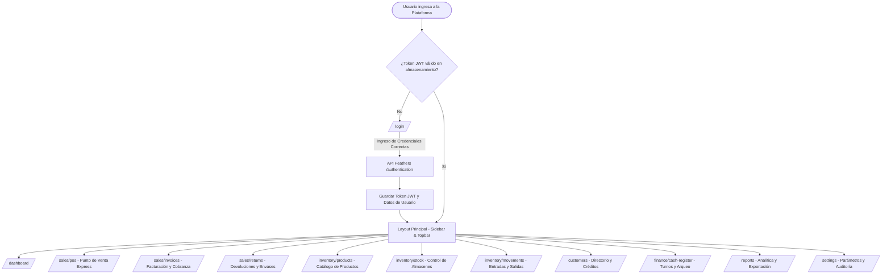
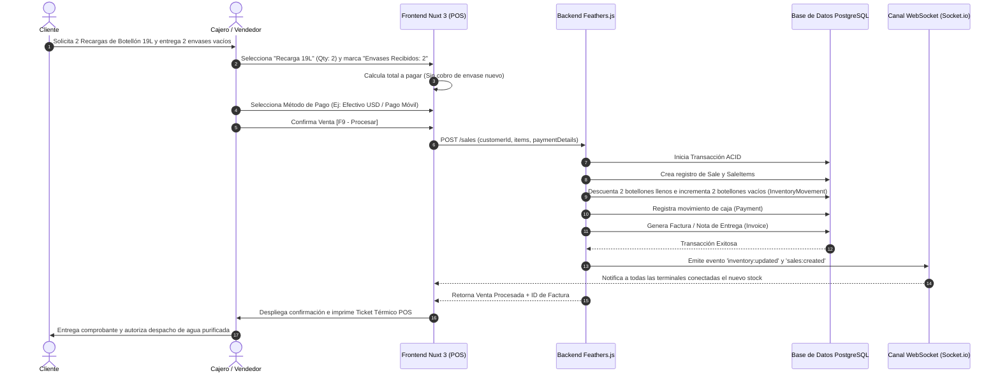
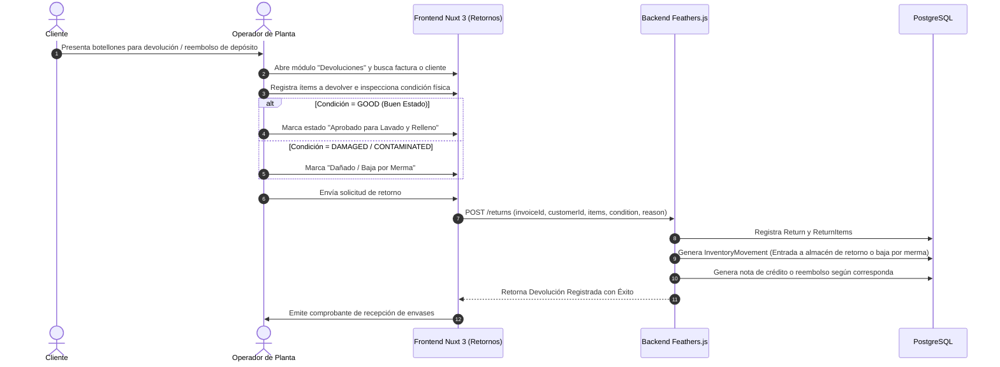
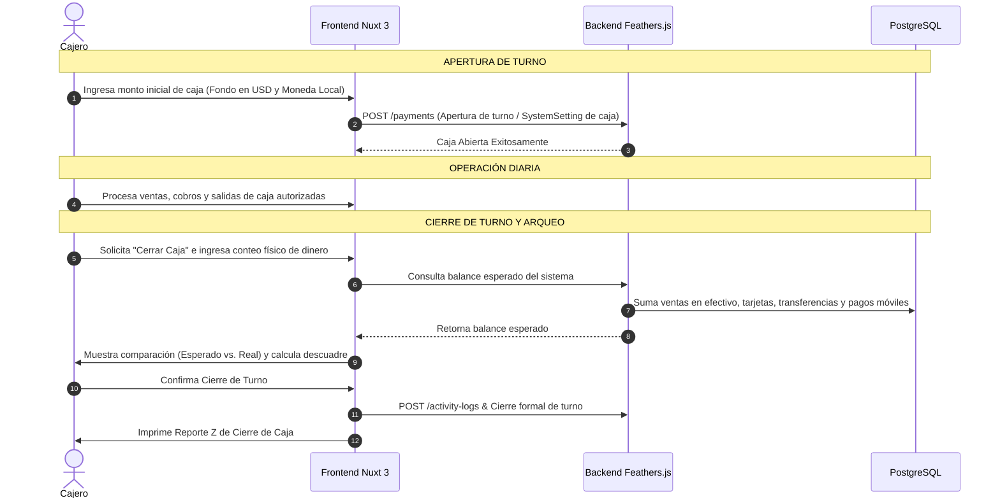

# 4. App Flow & Operational Navigation
## AquaPureSystem v1.0
### Flujos de Usuario, Diagramas de Secuencia y Matriz de Acciones

---

## 1. Mapa de Navegación General

---

## 2. Diagramas de Flujo Operativo

### A. Flujo de Venta Express y Recarga de Botellones (POS)

---

### B. Flujo de Devolución de Envases Retornables y Garantías

---

### C. Flujo de Turnos de Caja y Arqueo

---

## 3. Matriz de Acciones por Botón y Ruteo

| Pantalla / Módulo | Elemento UI / Botón | Acción / Evento | Resultado / Destino |
|---|---|---|---|
| `/login` | Botón "Iniciar Sesión" | Valida credenciales contra `POST /authentication` | Guarda token JWT y navega a `/dashboard` |
| `/dashboard` | Tarjeta "Stock Crítico" | Clic en la tarjeta | Navega a `/inventory/stock?filter=low_stock` |
| `/dashboard` | Botón "Nueva Venta" | Clic en acceso directo | Navega a `/sales/pos` |
| `/sales/pos` | Grid de Producto | Clic en tarjeta de producto | Agrega ítem al carrito de venta |
| `/sales/pos` | Switch "Retorna Envase" | Toggle Sí / No | Ajusta precio restando/sumando costo de envase nuevo |
| `/sales/pos` | Botón "Cobrar [F9]" | Despliega modal de cobro multimoneda | Procesa `POST /sales` e imprime ticket |
| `/sales/invoices` | Botón "Registrar Pago" | Abre diálogo de abono a factura | Envía `POST /payments` y actualiza estado de factura |
| `/sales/returns` | Botón "Nueva Devolución" | Abre formulario de inspección de botellones | Registra `POST /returns` y movimiento de stock |
| `/inventory/stock` | Botón "Transferir Stock" | Modal de transferencia entre almacenes | Envía `POST /inventory-movements` tipo `TRANSFER_OUT/IN` |
| `/reports` | Botón "Exportar PDF" | Invoca generador jsPDF | Descarga reporte vectorial con membrete de la empresa |
| `/reports` | Botón "Exportar Excel" | Invoca exportador SheetJS (`xlsx`) | Descarga libro `.xlsx` con detalle de ventas/stock |
| Topbar | Botón "Cerrar Sesión" | Limpia almacenamiento local y desconecta Socket.io | Redirige inmediatamente a `/login` |
