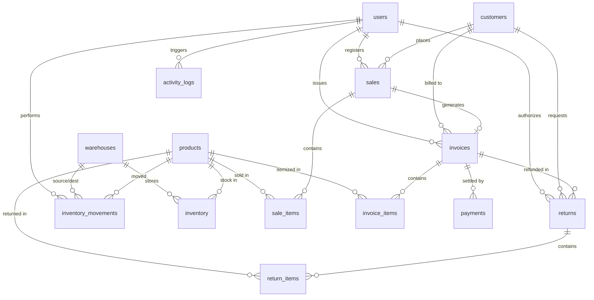

# 5. Backend Schema & Database Architecture
## AquaPureSystem v1.0
### Modelo Entidad-Relación, Especificación Prisma y Arquitectura de Dominio

---

## 1. Diagrama Entidad-Relación (ERD)

---

## 2. Descripción Detallada de Modelos (`schema.prisma`)

### A. Módulo de Seguridad y Usuarios
- **`User` (`users`)**:
  - `id` (String CUID, PK), `email` (Unique), `passwordHash`, `firstName`, `lastName`, `role` (`ADMIN`, `MANAGER`, `OPERATOR`, `VIEWER`), `isActive` (Boolean), `lastLoginAt`, `createdAt`, `updatedAt`.
  - Relaciones con ventas, facturas, logs de actividad, movimientos de almacén y retornos.

- **`ActivityLog` (`activity_logs`)**:
  - `id` (PK), `userId` (FK opcional), `action` (String), `entity` (String), `entityId` (String opcional), `oldData` (JSON), `newData` (JSON), `ipAddress`, `userAgent`, `createdAt`.
  - Provee una pista de auditoría inmutable para supervisar cambios de inventario, precios y anulaciones.

---

### B. Módulo de Productos e Inventario Multialmacén
- **`Product` (`products`)**:
  - `id` (PK), `sku` (Unique), `name`, `description`, `category` (`ProductCategory`), `unit` (`UnitOfMeasure`), `price` (Decimal 10,2), `cost` (Decimal 10,2), `minStock`, `maxStock`, `isActive`, `imageUrl`, `createdAt`, `updatedAt`.
  - *Categorías (`ProductCategory`)*: `WATER_BOTTLES`, `WATER_JUGS`, `FILTERS`, `ACCESSORIES`, `DISPENSERS`, `CHEMICALS`.
  - *Unidades de Medida (`UnitOfMeasure`)*: `UNIT`, `LITER`, `MILLILITER`, `BOX`, `PACK`.

- **`Warehouse` (`warehouses`)**:
  - `id` (PK), `name` (ej. "Planta Principal", "Depósito Norte", "Camión Reparto 01"), `code` (Unique), `address`, `isActive`, `createdAt`, `updatedAt`.

- **`Inventory` (`inventory`)**:
  - `id` (PK), `productId` (FK), `warehouseId` (FK), `quantity` (Int - stock disponible), `reservedQty` (Int - stock comprometido en pedidos pendientes), `updatedAt`.
  - Restricción única compuesta: `@@unique([productId, warehouseId])`.

- **`InventoryMovement` (`inventory_movements`)**:
  - `id` (PK), `productId` (FK), `warehouseId` (FK), `type` (`MovementType`), `quantity` (Int), `reason` (String opcional), `referenceId` (FK de venta, factura o retorno), `referenceType`, `userId` (FK), `createdAt`.
  - *Tipos de Movimiento (`MovementType`)*: `IN` (Entrada por compra/llenado), `OUT` (Salida por venta), `TRANSFER_IN` / `TRANSFER_OUT` (Traslados), `ADJUSTMENT` (Ajuste de inventario físico), `RETURN` (Reingreso por devolución), `LOSS` (Merma/daño de envase).

---

### C. Módulo de Clientes y Cuentas por Cobrar
- **`Customer` (`customers`)**:
  - `id` (PK), `code` (Unique), `name`, `email`, `phone`, `address`, `taxId` (RIF/NIT/RUC), `creditLimit` (Decimal 12,2), `isActive`, `createdAt`, `updatedAt`.
  - Gestiona clientes tanto minoristas como distribuidores con límites de crédito asignados.

---

### D. Módulo de Ventas y Facturación
- **`Sale` (`sales`)**:
  - `id` (PK), `saleNumber` (Unique, ej: `VTA-2026-0001`), `customerId` (FK), `userId` (FK), `status` (`SaleStatus`: `PENDING`, `CONFIRMED`, `SHIPPED`, `DELIVERED`, `CANCELLED`, `RETURNED`), `subtotal`, `taxAmount`, `discount`, `total`, `notes`, `saleDate`, `createdAt`, `updatedAt`.

- **`SaleItem` (`sale_items`)**:
  - `id` (PK), `saleId` (FK), `productId` (FK), `quantity` (Int), `unitPrice` (Decimal 10,2), `discount` (Decimal 10,2), `total` (Decimal 12,2).

- **`Invoice` (`invoices`)**:
  - `id` (PK), `invoiceNumber` (Unique, ej: `FAC-000123`), `saleId` (FK opcional, 1 a 1), `customerId` (FK), `userId` (FK), `status` (`InvoiceStatus`: `DRAFT`, `SENT`, `PAID`, `PARTIAL`, `OVERDUE`, `CANCELLED`, `REFUNDED`), `subtotal`, `taxAmount`, `total`, `issueDate`, `dueDate`, `paidDate`, `notes`, `createdAt`, `updatedAt`.

- **`InvoiceItem` (`invoice_items`)**:
  - `id` (PK), `invoiceId` (FK), `productId` (FK), `quantity` (Int), `unitPrice` (Decimal 10,2), `discount`, `taxRate` (Decimal 5,2, default: 21.00%), `total` (Decimal 12,2).

---

### E. Módulo de Retornos y Devolución de Envases
- **`Return` (`returns`)**:
  - `id` (PK), `returnNumber` (Unique, ej: `RET-00045`), `invoiceId` (FK), `customerId` (FK), `userId` (FK), `status` (`ReturnStatus`: `PENDING`, `APPROVED`, `REJECTED`, `PROCESSED`, `REFUNDED`), `reason`, `total`, `createdAt`, `updatedAt`.

- **`ReturnItem` (`return_items`)**:
  - `id` (PK), `returnId` (FK), `productId` (FK), `quantity` (Int), `unitPrice`, `reason`, `condition` (`ReturnCondition`: `GOOD`, `DAMAGED`, `EXPIRED`, `WRONG_PRODUCT`).

---

### F. Módulo de Pagos y Configuración
- **`Payment` (`payments`)**:
  - `id` (PK), `paymentNumber` (Unique, ej: `PAG-00078`), `invoiceId` (FK), `amount` (Decimal 12,2), `method` (`PaymentMethod`: `CASH`, `CARD`, `TRANSFER`, `CHECK`, `DIGITAL_WALLET`, `OTHER`), `reference` (Número de comprobante bancario), `status` (`PaymentStatus`: `PENDING`, `COMPLETED`, `FAILED`, `REFUNDED`), `paidAt`, `createdAt`.

- **`SystemSetting` (`system_settings`)**:
  - `id` (PK), `key` (Unique), `value` (String), `type` (`STRING`, `NUMBER`, `BOOLEAN`, `JSON`, `COLOR`), `description`, `isPublic`, `createdAt`, `updatedAt`.
  - Almacena configuración dinámica (tasa BCV/cambiaria, nombre comercial, RIF de empresa, texto de pie de página de facturas).

---

## 3. Reglas de Integridad y Transaccionalidad

1. **Atomicidad en Ventas**:
   - Cada creación de `Sale` descuenta de manera transaccional el stock del almacén mediante Prisma `$transaction`, registrando concurrentemente el `InventoryMovement`.
2. **Validación de Límites de Crédito**:
   - Al registrar una venta a crédito (`InvoiceStatus = SENT` sin pago inmediato), el sistema valida que `(Saldo Deudor Actual + Total de Nueva Factura) <= Customer.creditLimit`.
3. **Control de Retorno de Envases**:
   - Los ítems con condición `GOOD` se ingresan al almacén de botellones vacíos disponibles para lavado y rellenado; los ítems con condición `DAMAGED` se registran como `MovementType = LOSS` para no distorsionar el stock utilizable.
