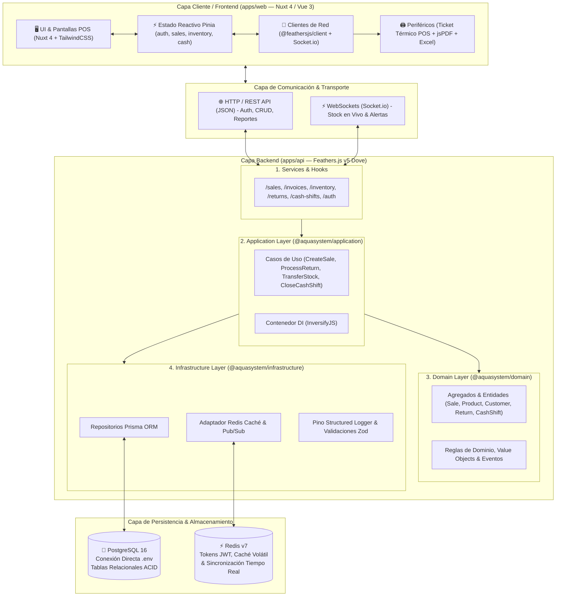
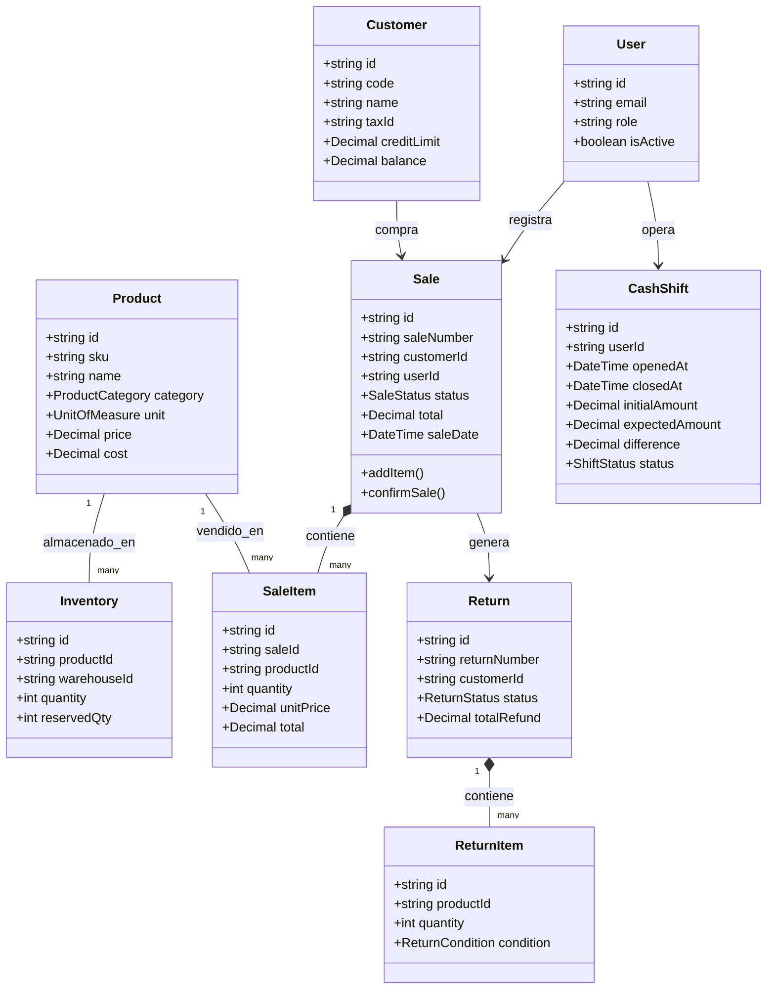
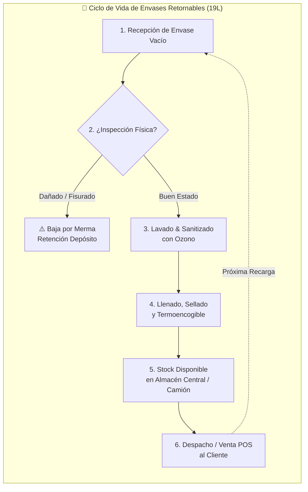

# 📐 Diagramas Técnicos y de Negocio — AquaPureSystem v1.0

Este directorio contiene los diagramas oficiales de arquitectura, conexión técnica, casos de uso, estructura de clases y ciclos de vida de **AquaPureSystem**.

Los archivos `.excalidraw` se pueden:
1. **Arrastrar y soltar** directamente en el editor web [excalidraw.com](https://excalidraw.com).
2. **Abrir en VS Code / Cursor / IDE** instalando la extensión oficial de Excalidraw.
3. **Modificar y regenerar** ejecutando el script [`scripts/generate_excalidraw_diagrams.py`](file:///home/jav1978/Documents/Desarrollo2026/Aplicaciones/aquapuresystem/scripts/generate_excalidraw_diagrams.py).

---

## 📂 Archivos de Diagramas Excalidraw Disponibles

| Archivo Excalidraw | Descripción |
|---|---|
| [`1_arquitectura_tecnica_conexion.excalidraw`](file:///home/jav1978/Documents/Desarrollo2026/Aplicaciones/aquapuresystem/docs/diagrams/1_arquitectura_tecnica_conexion.excalidraw) | Arquitectura técnica completa: Frontend (Nuxt 4 / Vue 3 + Pinia), Transporte (REST + WebSockets), Backend (Feathers.js v5 + Clean Architecture DDD / InversifyJS / Prisma ORM) y Persistencia (PostgreSQL 16 + Redis). |
| [`2_casos_de_uso_y_clases.excalidraw`](file:///home/jav1978/Documents/Desarrollo2026/Aplicaciones/aquapuresystem/docs/diagrams/2_casos_de_uso_y_clases.excalidraw) | Diagrama de Casos de Uso con todos los actores (Cliente, Cajero, Operador Planta, Administrador) y Diagrama de Clases / Modelo de Dominio DDD (`Sale`, `Product`, `Inventory`, `Invoice`, `Return`, `CashShift`, `User`). |
| [`3_flujo_ciclo_de_vida_sistema.excalidraw`](file:///home/jav1978/Documents/Desarrollo2026/Aplicaciones/aquapuresystem/docs/diagrams/3_flujo_ciclo_de_vida_sistema.excalidraw) | Flujo del ciclo de vida de los botellones retornables de 19L (Recepción, Inspección, Lavado, Llenado, Venta, Retorno) y Flujo de Transacción POS Express atómica con impacto contable y de stock. |

---

## 1. Diagrama Técnico de Arquitectura y Conexión



---

## 2. Diagrama de Casos de Uso y Modelo de Clases de Dominio

### Actores del Sistema
- **👤 Cliente**: Adquiere productos, recarga botellones y devuelve envases.
- **💼 Cajero / POS**: Procesa cobros express, apertura/cierre de turnos de caja y emisión de tickets.
- **🏭 Operador de Planta**: Inspecciona condición física de envases retornados (Óptimo vs Merma) y gestiona traslados de stock.
- **👑 Administrador**: Configura parámetros, consulta métricas financieras, audita transacciones y autoriza ajustes.

### Modelo Entidad-Relación y Clases DDD



---

## 3. Flujo del Ciclo de Vida de Envases y Venta POS



---

## 🚀 Cómo Regenerar los Archivos Excalidraw

Si deseas actualizar las dimensiones, colores o textos de los diagramas, puedes ejecutar:

```bash
python3 scripts/generate_excalidraw_diagrams.py
```
